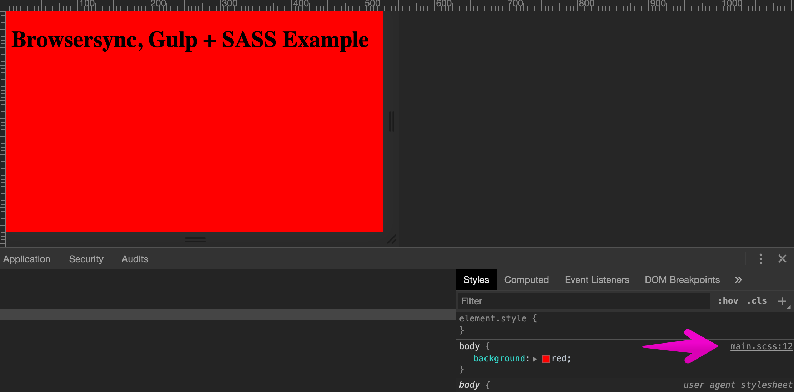
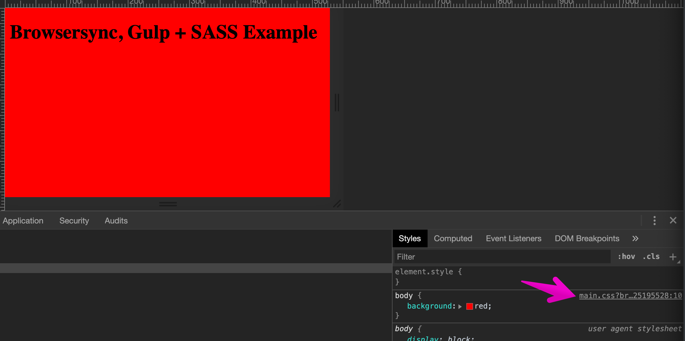

# Demonstration of chrome livereloading bug.
POC for a bug in chromes sourcemaps when using livereload.

Some source forked from: https://github.com/Browsersync/recipes/tree/master/recipes/server

Bug filed at: https://bugs.chromium.org/p/chromium/issues/detail?id=1044383

This example uses SASS instead of LESS as its better supported and easier to make 
a demonstration. 

**Step 1**: Clone this entire repo
```bash
$ git clone https://github.com/TristanBrotherton/chrome_live_reload_bug.git
```

**Step 2**: Move into the directory containing this example
```bash
$ cd chrome_live_reload_bug
```

**Step 3**: Install dependencies
```bash
$ npm install
```

**Step 4**: Run the example
```bash
$ npm start
```

### Reproduce Bug:

**Step 1**: View the test server at: http://localhost:3000/

**Step 2**: Open Developer tools and inspect the `body` element 


Note the correct source mapping 

**Step 2**: Edit / touch the file to create a live reload.
`app/scss/main.css` 

**Step 2**: Note correct sourcemapping has been lost:


**Step 3**: Reload developer tools (option + r) to reset the sourcemapping


